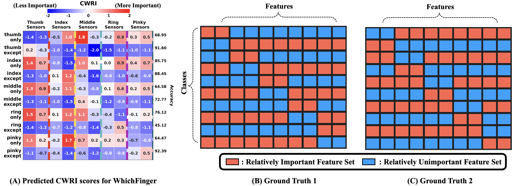

# WhichFinger Dataset from CAFO: Feature-Centric Explanation on Time Series Classification 

This is the WhichFinger Multivariate Time Series (MTS) dataset from the SIGKDD 2024 paper `CAFO: Feature-Centric Explanation on Time Series Classification` by **Jaeho Kim**, Seok-Ju (Adam) Hahn, Yoontae Hwang, Junghye Lee, and Seulki Lee. 

## WhichFinger Dataset
The WhichFinger Dataset is a multivariate time series (MTS) dataset, designed for eXplainable Artificial Intelligence (XAI) applications. This dataset offers comprehensive information on the data collection process for each class, as well as the features relevant to specific classes, which facilitates the validation of the CWRI measure. We created this dataset because, to the best of our knowledge, no public MTS datasets met the following three criteria: (1) strong prior knowledge or information regarding each feature's contribution to specific classes, (2) a sufficient number of classes $(C\geq2)$ and features $(D\geq2)$, and (3) an adequate number of samples $(N\geq1,000)$. In this section, we describe the detailed data collection process and the preprocessing steps involved in the creation of the dataset.

Please kindly refer to `Appendix G: WhichFinger Dataset` for further details.

## Simple Statistics.
- Total Sample Size: 18,010
- Windowed Time Series Length: 120 (You can change this as we provide the raw data)
- Users: 19
- Features: 10 Sensors
- Class: (1) Thumb only, (2) Thumb except, (3) Index only, (4) Index except, (5) Middle only, (6) Middle except, (7) Ring only, (8) Ring except, (9) Pinky only, and (10) Pinky except

## GoogleDrive Link
https://drive.google.com/drive/folders/16Xks-9O6BeTFHOba9-HZRZcnd2GnrUVg?usp=sharing

## GoogleDrive Contents
- `WhichFinger/raw_data_df.pkl`: This contains the whole raw data. You can load this file in the `notebook/preprocess.ipynb` for preprocessing, or you can use the below.
- `WhichFinger/WhichFinger_ModelTraining`: Containing the preprocessed files used for model training.
- `answer_sheet.csv`: The Answer Sheet used to evaluate the `CWRI` metrics.
- `finger_dataset.py`: A PyTorch Dataset class
- `fingergesture.pkl`: We used this file for model training. It is basically the same file.
- `label_df.csv`: Contains meta info, and `y_true`. 

## Contents
- `notebook/01_preprocess_raw.ipynb`: This notebook contains the preprocessing script for the WhichFinger.
- `notebook/02_evaluate_cwri.ipynb`: This notebook contains the minimal code to evaluate our CWRI score. 

## Ground Truth Evaluation

Please kindly refer to `Appendix E: Evaluation of CWRI Metrics` for further explanation.

## License for Data Use
We apply the Creative Commons Attribution-NonCommercial 4.0 International License.
